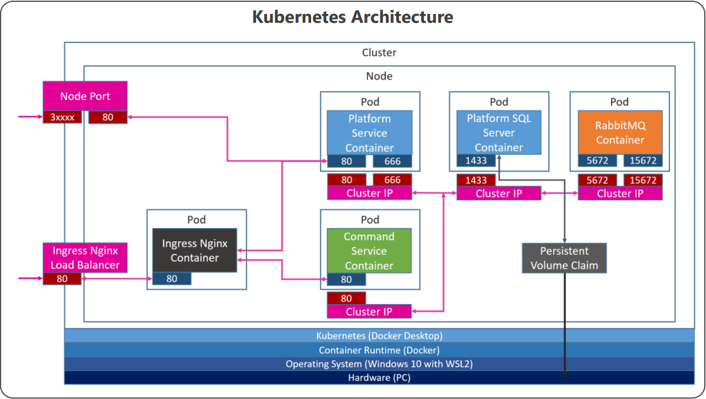

# .NET-Microservices-Course
Code for Les Jackson's introduction to .NET Microservices course
> https://www.youtube.com/watch?v=DgVjEo3OGBI

## platform-service
Track all the platforms / systems of a company

## command-service
Function as a command line repository for given platforms and systems

## K8S
Contains yaml files to apply in Kubernetes
